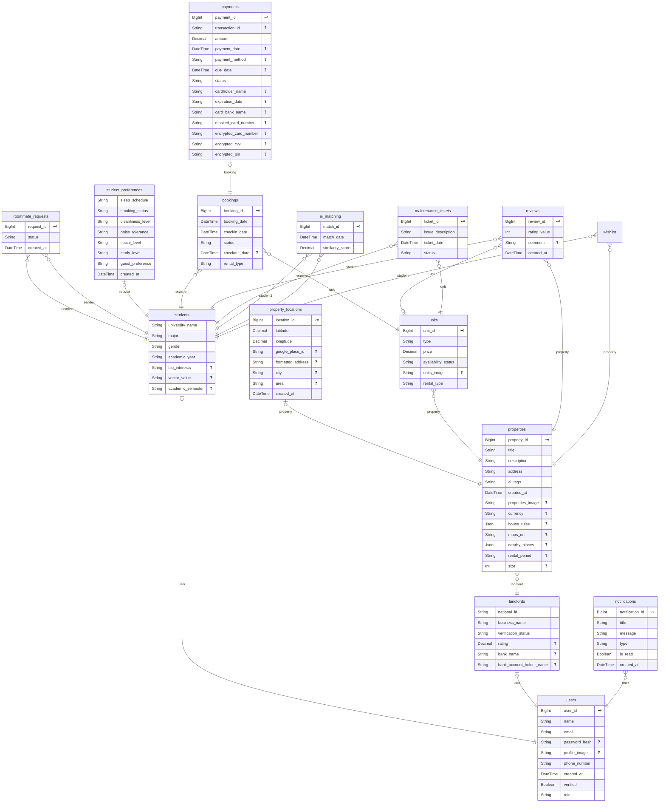

```mermaid
erDiagram

  "users" {
    BigInt user_id "🗝️"
    String name 
    String email 
    String password_hash "❓"
    String profile_image "❓"
    String phone_number 
    DateTime created_at 
    Boolean verified 
    String role 
    }
  

  "students" {
    String university_name 
    String major 
    String gender 
    String academic_year 
    String bio_interests "❓"
    String vector_value "❓"
    String academic_semester "❓"
    }
  

  "roommate_requests" {
    BigInt request_id "🗝️"
    String status 
    DateTime created_at 
    }
  

  "student_preferences" {
    String sleep_schedule 
    String smoking_status 
    String cleanliness_level 
    String noise_tolerance 
    String social_level 
    String study_level 
    String guest_preference 
    DateTime created_at 
    }
  

  "landlords" {
    String national_id 
    String business_name 
    String verification_status 
    Decimal rating "❓"
    String bank_name "❓"
    String bank_account_holder_name "❓"
    }
  

  "properties" {
    BigInt property_id "🗝️"
    String title 
    String description 
    String address 
    String ai_tags 
    DateTime created_at 
    String properties_image "❓"
    String currency "❓"
    Json house_rules "❓"
    String maps_url "❓"
    Json nearby_places "❓"
    String rental_period "❓"
    Int size "❓"
    }
  

  "property_locations" {
    BigInt location_id "🗝️"
    Decimal latitude 
    Decimal longitude 
    String google_place_id "❓"
    String formatted_address "❓"
    String city "❓"
    String area "❓"
    DateTime created_at 
    }
  

  "units" {
    BigInt unit_id "🗝️"
    String type 
    Decimal price 
    String availability_status 
    String units_image "❓"
    String rental_type 
    }
  

  "bookings" {
    BigInt booking_id "🗝️"
    DateTime booking_date 
    DateTime checkin_date 
    String status 
    DateTime checkout_date "❓"
    String rental_type 
    }
  

  "payments" {
    BigInt payment_id "🗝️"
    String transaction_id "❓"
    Decimal amount 
    DateTime payment_date "❓"
    String payment_method "❓"
    DateTime due_date "❓"
    String status 
    String cardholder_name "❓"
    String expiration_date "❓"
    String card_bank_name "❓"
    String masked_card_number "❓"
    String encrypted_card_number "❓"
    String encrypted_cvv "❓"
    String encrypted_pin "❓"
    }
  

  "reviews" {
    BigInt review_id "🗝️"
    Int rating_value 
    String comment "❓"
    DateTime created_at 
    }
  

  "maintenance_tickets" {
    BigInt ticket_id "🗝️"
    String issue_description 
    DateTime ticket_date 
    String status 
    }
  

  "ai_matching" {
    BigInt match_id "🗝️"
    DateTime match_date 
    Decimal similarity_score 
    }
  

  "notifications" {
    BigInt notification_id "🗝️"
    String title 
    String message 
    String type 
    Boolean is_read 
    DateTime created_at 
    }
  

  "wishlist" {

    }
  
    "students" |o--|| users : "user"
    "roommate_requests" }o--|| students : "receiver"
    "roommate_requests" }o--|| students : "sender"
    "student_preferences" |o--|| students : "student"
    "landlords" |o--|| users : "user"
    "properties" }o--|| landlords : "landlord"
    "property_locations" |o--|| properties : "property"
    "units" }o--|| properties : "property"
    "bookings" }o--|| students : "student"
    "bookings" }o--|| units : "unit"
    "payments" |o--|| bookings : "booking"
    "reviews" }o--|| properties : "property"
    "reviews" }o--|| students : "student"
    "reviews" }o--|o units : "unit"
    "maintenance_tickets" }o--|| students : "student"
    "maintenance_tickets" }o--|| units : "unit"
    "ai_matching" }o--|| students : "student1"
    "ai_matching" }o--|| students : "student2"
    "notifications" }o--|| users : "user"
    "wishlist" }o--|| students : "student"
    "wishlist" }o--|| properties : "property"
```
