# Nestify Database ERD and Structure Documentation

This document provides a comprehensive overview of the database structure for the **Nestify** platform. Nestify utilizes **PostgreSQL** as its core relational database engine, orchestrated via the **Prisma ORM**.

---

## 📊 Entity Relationship Diagram (ERD)

The following diagram represents the database tables, fields, and relationships. It uses standard Crow's Foot notation to show cardinality.

```mermaid
erDiagram
    users ||--o| students : "1-to-0/1 profile mapping (student_id = user_id)"
    users ||--o| landlords : "1-to-0/1 profile mapping (landlord_id = user_id)"
    users ||--o{ notifications : "1-to-many user notifications"

    students ||--o{ roommate_requests : "sends/receives roommate requests"
    students ||--o| student_preferences : "1-to-1 matching preferences (student_id)"
    students ||--o{ bookings : "makes bookings"
    students ||--o{ reviews : "writes reviews"
    students ||--o{ maintenance_tickets : "submits maintenance tickets"
    students ||--o{ ai_matching : "participates in AI-based matchmaking"
    students ||--o{ wishlist : "adds properties to wishlist"

    landlords ||--o{ properties : "owns properties"

    properties ||--o| property_locations : "1-to-1 physical address location"
    properties ||--o{ units : "contains units (rooms/beds)"
    properties ||--o{ reviews : "receives property-wide reviews"
    properties ||--o{ wishlist : "favorited in user wishlists"

    units ||--o{ bookings : "is booked"
    units ||--o{ maintenance_tickets : "has maintenance requests"
    units ||--o{ reviews : "receives unit-specific reviews"

    bookings ||--o| payments : "1-to-1 payment (booking_id)"

    users {
        bigint user_id PK "Incrementing ID"
        varchar name "Full Name"
        varchar email UK "Unique Email Address"
        string password_hash "Nullable for OAuth users"
        varchar profile_image "URL to profile picture"
        varchar phone_number "Contact number"
        timestamp created_at "Record creation date"
        boolean verified "Email verification flag"
        varchar role "Role: student, landlord, admin"
    }

    students {
        bigint student_id PK, FK "References users.user_id"
        varchar university_name "Academic Institution"
        varchar major "Field of study"
        varchar gender "Gender identity"
        varchar academic_year "Current year (e.g. Freshman)"
        varchar academic_semester "Current semester"
        text bio_interests "Short bio & tags"
        text vector_value "FAISS roommate preference vector"
    }

    student_preferences {
        bigint student_id PK, FK "References students.student_id"
        varchar sleep_schedule "Early bird / Night owl"
        varchar smoking_status "Smoker / Non-smoker"
        varchar cleanliness_level "Clean / Messy / Average"
        varchar noise_tolerance "Quiet / Moderate / Loud"
        varchar social_level "Introvert / Extrovert / Mixed"
        varchar study_level "Quiet study / Group study"
        varchar guest_preference "No guests / Allowed"
        timestamp created_at "Preference creation timestamp"
    }

    landlords {
        bigint landlord_id PK, FK "References users.user_id"
        varchar national_id UK "Unique Government National ID"
        varchar business_name "Company / Host Name"
        varchar verification_status "Pending / Approved / Rejected"
        decimal rating "Aggregated rating"
        varchar bank_name "Payout bank name"
        varchar bank_account_holder_name "Payout account holder"
    }

    properties {
        bigint property_id PK "Property ID"
        bigint landlord_id FK "References landlords.landlord_id"
        varchar title "Listing Title"
        text description "Detailed description"
        text address "Physical street address"
        text ai_tags "Comma-separated AI tags"
        varchar properties_image "Hero image URL"
        varchar currency "Listing currency"
        json house_rules "JSON array of rules"
        varchar maps_url "Google Maps URL link"
        json nearby_places "JSON array of nearby locations"
        varchar rental_period "Minimum lease term"
        int size "Area size in sq meters"
        timestamp created_at "Listing timestamp"
    }

    property_locations {
        bigint location_id PK "Location details ID"
        bigint property_id UK, FK "References properties.property_id"
        decimal latitude "GPS Latitude"
        decimal longitude "GPS Longitude"
        varchar google_place_id "Google Places reference"
        text formatted_address "Standardized address"
        varchar city "City location"
        varchar area "Neighborhood or Area"
        timestamp created_at "Creation timestamp"
    }

    units {
        bigint unit_id PK "Unit ID"
        bigint property_id FK "References properties.property_id"
        varchar type "Shared Bed, Private Room, Full Apt"
        decimal price "Rental rate cost"
        varchar availability_status "Available / Booked / Maintenance"
        varchar units_image "Room/Bed image URL"
        varchar rental_type "Monthly / Semesterly / Yearly"
    }

    bookings {
        bigint booking_id PK "Booking Reservation ID"
        bigint student_id FK "References students.student_id"
        bigint unit_id FK "References units.unit_id"
        date booking_date "Reservation timestamp"
        date checkin_date "Scheduled arrival date"
        date checkout_date "Scheduled departure date"
        varchar status "Pending / Confirmed / Cancelled"
        varchar rental_type "Monthly / Semesterly / Yearly"
    }

    payments {
        bigint payment_id PK "Transaction Record ID"
        bigint booking_id UK, FK "References bookings.booking_id"
        varchar transaction_id UK "Payment gateway transaction key"
        decimal amount "Calculated payment sum"
        date payment_date "Payment completed date"
        varchar payment_method "Credit Card / Cash / Bank"
        date due_date "Payment deadline"
        varchar status "Pending / Paid / Overdue"
        varchar cardholder_name "Masked billing name"
        varchar expiration_date "Card expiration date"
        varchar card_bank_name "Card issuing bank"
        varchar masked_card_number "Last 4 digits card format"
        text encrypted_card_number "Secure data"
        text encrypted_cvv "Secure CVV code"
        text encrypted_pin "Secure ATM pin"
    }

    roommate_requests {
        bigint request_id PK "Request ID"
        bigint sender_id FK "References students.student_id"
        bigint receiver_id FK "References students.student_id"
        varchar status "Pending / Accepted / Rejected"
        timestamp created_at "Requested date"
    }

    ai_matching {
        bigint match_id PK "Match ID"
        bigint student1_id FK "References students.student_id"
        bigint student2_id FK "References students.student_id"
        date match_date "Evaluation date"
        decimal similarity_score "Cosine match strength"
    }

    reviews {
        bigint review_id PK "Review ID"
        bigint student_id FK "References students.student_id"
        bigint property_id FK "References properties.property_id"
        bigint unit_id FK "References units.unit_id (Nullable)"
        int rating_value "Score 1-5"
        text comment "Written feedback"
        timestamp created_at "Feedback date"
    }

    maintenance_tickets {
        bigint ticket_id PK "Ticket ID"
        bigint student_id FK "References students.student_id"
        bigint unit_id FK "References units.unit_id"
        text issue_description "Maintenance description"
        date ticket_date "Opened timestamp"
        varchar status "Open / In_Progress / Resolved"
    }

    notifications {
        bigint notification_id PK "Notification ID"
        bigint user_id FK "References users.user_id"
        varchar title "Alert Heading"
        text message "Alert details"
        varchar type "Billing / Maintenance / System"
        boolean is_read "Read status"
        timestamp created_at "Alert timestamp"
    }

    wishlist {
        bigint student_id PK, FK "References students.student_id"
        bigint property_id PK, FK "References properties.property_id"
    }
```

---

## 🏛️ Schema Specifications and Tables

Below are the detailed schemas of each table in the Nestify database:

### 1. `users` Table
Stores core identity and authentication information for all user categories (Students, Landlords, Admins).

| Column Name | Data Type | Constraints / Keys | Default | Description |
| :--- | :--- | :--- | :--- | :--- |
| `user_id` | `BigInt` | Primary Key, Autoincrement | *None* | Unique ID for each registered user. |
| `name` | `VarChar(100)` | Not Null | *None* | Full name of the user. |
| `email` | `VarChar(255)` | Not Null, Unique | *None* | Email address (used as login username). |
| `password_hash`| `Text` | Nullable | `NULL` | Encrypted password hash (null for OAuth users). |
| `profile_image`| `VarChar(255)` | Nullable | `NULL` | URL or path to the user's avatar. |
| `phone_number` | `VarChar(20)` | Not Null | *None* | User phone contact number. |
| `created_at` | `Timestamp(6)` | Not Null | `NOW()` | Timestamp when user was created. |
| `verified` | `Boolean` | Not Null | `false` | Email verification status flag. |
| `role` | `VarChar(20)` | Not Null | `"student"` | Role of the user (`student`, `landlord`, `admin`). |

---

### 2. `students` Table
Extends the base `users` table for student-specific details. Implements a 1-to-1 supertype/subtype relation with `users`.

| Column Name | Data Type | Constraints / Keys | Default | Description |
| :--- | :--- | :--- | :--- | :--- |
| `student_id` | `BigInt` | Primary Key, Foreign Key (Cascade) | *None* | Links directly to `users.user_id`. |
| `university_name`| `VarChar(150)`| Not Null | *None* | Academic institution name. |
| `major` | `VarChar(100)`| Not Null | *None* | Field of study (e.g. Computer Science). |
| `gender` | `VarChar(20)` | Not Null | *None* | Gender identity (for matching/filtering). |
| `academic_year`| `VarChar(30)` | Not Null | *None* | Current year of study (e.g., Sophomore). |
| `academic_semester`| `VarChar(30)`| Nullable | `NULL` | Current academic semester. |
| `bio_interests`| `Text` | Nullable | `NULL` | Short biography and tags/hobbies. |
| `vector_value` | `Text` | Nullable | `NULL` | Roommate matching preferences representation (serialized vector). |

---

### 3. `student_preferences` Table
Stores roommate matching criteria used to compute cosine similarity scores.

| Column Name | Data Type | Constraints / Keys | Default | Description |
| :--- | :--- | :--- | :--- | :--- |
| `student_id` | `BigInt` | Primary Key, Foreign Key (Cascade) | *None* | Links directly to `students.student_id`. |
| `sleep_schedule`| `VarChar(50)` | Not Null | *None* | Night owl / Early bird preference. |
| `smoking_status`| `VarChar(50)` | Not Null | *None* | Smoking tolerance level. |
| `cleanliness_level`| `VarChar(50)`| Not Null | *None* | Tidy / Messy / Average expectations. |
| `noise_tolerance`| `VarChar(50)`| Not Null | *None* | High / Low noise preference. |
| `social_level` | `VarChar(50)` | Not Null | *None* | Introvert / Extrovert rating. |
| `study_level` | `VarChar(50)` | Not Null | *None* | Preferred studying atmosphere. |
| `guest_preference`| `VarChar(50)`| Not Null | *None* | Guidelines on allowing guests. |
| `created_at` | `Timestamp(6)`| Not Null | `NOW()` | Timestamp when preferences were added. |

---

### 4. `roommate_requests` Table
Tracks matching requests exchanged between students.

| Column Name | Data Type | Constraints / Keys | Default | Description |
| :--- | :--- | :--- | :--- | :--- |
| `request_id` | `BigInt` | Primary Key, Autoincrement | *None* | Unique Request ID. |
| `sender_id` | `BigInt` | Foreign Key (Cascade) | *None* | Sender `student_id`. |
| `receiver_id` | `BigInt` | Foreign Key (Cascade) | *None* | Receiver `student_id`. |
| `status` | `VarChar(30)` | Not Null | `"pending"`| Status (`pending`, `accepted`, `rejected`). |
| `created_at` | `Timestamp(6)`| Not Null | `NOW()` | Date request was initiated. |

* **Constraints**: Unique index `uq_sender_receiver` on `(sender_id, receiver_id)`.

---

### 5. `landlords` Table
Extends the base `users` table for landlord-specific business, payouts, and verifications.

| Column Name | Data Type | Constraints / Keys | Default | Description |
| :--- | :--- | :--- | :--- | :--- |
| `landlord_id` | `BigInt` | Primary Key, Foreign Key (Cascade) | *None* | Links directly to `users.user_id`. |
| `national_id` | `VarChar(50)` | Not Null, Unique | *None* | Official government national identity document. |
| `business_name`| `VarChar(150)`| Not Null | *None* | Registered name or host entity title. |
| `verification_status`| `VarChar(30)`| Not Null | `"pending"`| Approval status (`pending`, `approved`, `rejected`). |
| `rating` | `Decimal(3,2)`| Nullable | `0.00` | Aggregated property reviews rating. |
| `bank_name` | `VarChar(150)`| Nullable | `NULL` | Primary bank for receiving deposits. |
| `bank_account_holder_name`| `VarChar(150)`| Nullable| `NULL`| Name on destination bank account. |

---

### 6. `properties` Table
Defines student housing complexes or buildings listed by landlords.

| Column Name | Data Type | Constraints / Keys | Default | Description |
| :--- | :--- | :--- | :--- | :--- |
| `property_id` | `BigInt` | Primary Key, Autoincrement | *None* | Unique listing ID. |
| `landlord_id` | `BigInt` | Foreign Key (Cascade) | *None* | Properties' listing owner. |
| `title` | `VarChar(150)`| Not Null | *None* | Headline title of the building/complex. |
| `description` | `Text` | Not Null | *None* | Long form descriptive text. |
| `address` | `Text` | Not Null | *None* | Physical street address. |
| `ai_tags` | `Text` | Not Null | *None* | Automated feature tags (e.g. WiFi, Pool). |
| `properties_image`| `Text` | Nullable | `NULL` | Hero image URL/path. |
| `currency` | `VarChar(10)` | Nullable | `NULL` | Currency symbol/code. |
| `house_rules` | `Json` | Nullable | `NULL` | JSON structure defining house policies. |
| `maps_url` | `VarChar(500)`| Nullable | `NULL` | Link to Google Maps location pin. |
| `nearby_places`| `Json` | Nullable | `NULL` | JSON structure detailing local key areas. |
| `rental_period`| `VarChar(50)` | Nullable | `NULL` | Custom lease duration requirements. |
| `size` | `Int` | Nullable | `NULL` | Total space sizing in sq. meters. |
| `created_at` | `Timestamp(6)`| Not Null | `NOW()` | Listing creation date. |

---

### 7. `property_locations` Table
Holds geographical coordinate maps mapping properties for high-performance radius queries.

| Column Name | Data Type | Constraints / Keys | Default | Description |
| :--- | :--- | :--- | :--- | :--- |
| `location_id` | `BigInt` | Primary Key, Autoincrement | *None* | Map registration ID. |
| `property_id` | `BigInt` | Unique, Foreign Key (Cascade)| *None* | Property ID. |
| `latitude` | `Decimal(10,7)`| Not Null | *None* | Geographic latitude. |
| `longitude` | `Decimal(10,7)`| Not Null | *None* | Geographic longitude. |
| `google_place_id`| `VarChar(255)`| Nullable | `NULL` | API reference key for Google Places. |
| `formatted_address`| `Text` | Nullable | `NULL` | Google formatted address output. |
| `city` | `VarChar(100)`| Nullable | `NULL` | City division. |
| `area` | `VarChar(100)`| Nullable | `NULL` | Local district neighborhood. |
| `created_at` | `Timestamp(6)`| Not Null | `NOW()` | Location record timestamp. |

---

### 8. `units` Table
Represents specific rooms or single bed spaces inside a property, allowing granular availability status.

| Column Name | Data Type | Constraints / Keys | Default | Description |
| :--- | :--- | :--- | :--- | :--- |
| `unit_id` | `BigInt` | Primary Key, Autoincrement | *None* | Unique Unit ID. |
| `property_id` | `BigInt` | Foreign Key (Cascade) | *None* | Parent property housing the unit. |
| `type` | `VarChar(50)` | Not Null | *None* | Room style (e.g. Single, Twin bed). |
| `price` | `Decimal(10,2)`| Not Null | *None* | Rental rate cost. |
| `availability_status`| `VarChar(30)`| Not Null | `"available"`| Current flag (`available`, `booked`, etc.). |
| `units_image` | `VarChar(255)`| Nullable | `NULL` | Photo URL of the unit. |
| `rental_type` | `VarChar(20)` | Not Null | `"monthly"`| Rental billing type. |

---

### 9. `bookings` Table
Manages tenancy agreements, tracking which student is assigned to what unit.

| Column Name | Data Type | Constraints / Keys | Default | Description |
| :--- | :--- | :--- | :--- | :--- |
| `booking_id` | `BigInt` | Primary Key, Autoincrement | *None* | Unique booking reference. |
| `student_id` | `BigInt` | Foreign Key (Cascade) | *None* | Tenant identifier. |
| `unit_id` | `BigInt` | Foreign Key (Cascade) | *None* | Booked room/bed space. |
| `booking_date` | `Date` | Not Null | `NOW()` | Date booking transaction occurred. |
| `checkin_date` | `Date` | Not Null | *None* | Active start lease date. |
| `checkout_date`| `Date` | Nullable | `NULL` | Expected move out date. |
| `status` | `VarChar(30)` | Not Null | `"pending"`| State (`pending`, `confirmed`, `cancelled`). |
| `rental_type` | `VarChar(20)` | Not Null | `"monthly"`| Configured rental type duration. |

---

### 10. `payments` Table
Manages financial records associated with bookings. Contains bank encryption fields for sensitive user card elements.

| Column Name | Data Type | Constraints / Keys | Default | Description |
| :--- | :--- | :--- | :--- | :--- |
| `payment_id` | `BigInt` | Primary Key, Autoincrement | *None* | Unique Payment ID. |
| `booking_id` | `BigInt` | Unique, Foreign Key (Cascade)| *None* | Booking reference. |
| `transaction_id`| `VarChar(100)`| Unique, Nullable | `NULL` | Transaction reference from gateway. |
| `amount` | `Decimal(10,2)`| Not Null | *None* | Value paid. |
| `payment_date` | `Date` | Nullable | `NULL` | Settled payment date. |
| `payment_method`| `VarChar(50)` | Nullable | `NULL` | Method used (Card, Bank). |
| `due_date` | `Date` | Nullable | `NULL` | Payment due date. |
| `status` | `VarChar(20)` | Not Null | `"pending"`| Transaction state (`pending`, `paid`, `overdue`). |
| `cardholder_name`| `VarChar(150)`| Nullable | `NULL` | Name on card billing info. |
| `expiration_date`| `VarChar(10)` | Nullable | `NULL` | Card expiration. |
| `card_bank_name`| `VarChar(150)`| Nullable | `NULL` | Associated issuer bank name. |
| `masked_card_number`| `VarChar(30)`| Nullable | `NULL` | Masked card number (e.g. `**** **** **** 1234`). |
| `encrypted_card_number`| `Text` | Nullable | `NULL` | Fully encrypted card number string. |
| `encrypted_cvv` | `Text` | Nullable | `NULL` | Fully encrypted security value. |
| `encrypted_pin` | `Text` | Nullable | `NULL` | Fully encrypted PIN code. |

---

### 11. `reviews` Table
Allows students to submit feedback regarding properties and units they've booked.

| Column Name | Data Type | Constraints / Keys | Default | Description |
| :--- | :--- | :--- | :--- | :--- |
| `review_id` | `BigInt` | Primary Key, Autoincrement | *None* | Unique review identifier. |
| `student_id` | `BigInt` | Foreign Key (Cascade) | *None* | Student author. |
| `property_id` | `BigInt` | Foreign Key (Cascade) | *None* | Target property reviewed. |
| `unit_id` | `BigInt` | Foreign Key (Cascade), Nullable | `NULL` | Specific unit reviewed (if any). |
| `rating_value` | `Int` | Not Null | *None* | Numeric score (1-5 scale). |
| `comment` | `Text` | Nullable | `NULL` | Written review feedback text. |
| `created_at` | `Timestamp(6)`| Not Null | `NOW()` | Time when review was published. |

---

### 12. `maintenance_tickets` Table
Allows tenants to flag issues with their active units.

| Column Name | Data Type | Constraints / Keys | Default | Description |
| :--- | :--- | :--- | :--- | :--- |
| `ticket_id` | `BigInt` | Primary Key, Autoincrement | *None* | Unique ticket identifier. |
| `student_id` | `BigInt` | Foreign Key (Cascade) | *None* | Submitting student. |
| `unit_id` | `BigInt` | Foreign Key (Cascade) | *None* | Unit needing repairs. |
| `issue_description`| `Text` | Not Null | *None* | Detail descriptions of repairs needed. |
| `ticket_date` | `Date` | Not Null | `NOW()` | Submission date. |
| `status` | `VarChar(30)` | Not Null | `"open"` | Ticket lifecycle (`open`, `in_progress`, `resolved`). |

---

### 13. `ai_matching` Table
Stores pre-calculated matching evaluations between students.

| Column Name | Data Type | Constraints / Keys | Default | Description |
| :--- | :--- | :--- | :--- | :--- |
| `match_id` | `BigInt` | Primary Key, Autoincrement | *None* | Unique match evaluation entry. |
| `student1_id` | `BigInt` | Foreign Key (Cascade) | *None* | First student ID. |
| `student2_id` | `BigInt` | Foreign Key (Cascade) | *None* | Second student ID. |
| `match_date` | `Date` | Not Null | `NOW()` | Date score was calculated. |
| `similarity_score`| `Decimal(5,2)`| Not Null | *None* | Similarity score. |

* **Constraints**: Unique index `uq_student_pair` on `(student1_id, student2_id)`.

---

### 14. `notifications` Table
Stores system notifications and transactional alerts dispatched to users.

| Column Name | Data Type | Constraints / Keys | Default | Description |
| :--- | :--- | :--- | :--- | :--- |
| `notification_id`| `BigInt` | Primary Key, Autoincrement | *None* | Unique alert ID. |
| `user_id` | `BigInt` | Foreign Key (Cascade) | *None* | Target recipient. |
| `title` | `VarChar(150)`| Not Null | *None* | Alert title. |
| `message` | `Text` | Not Null | *None* | Alert detailed content. |
| `type` | `VarChar(50)` | Not Null | *None* | Notification group category. |
| `is_read` | `Boolean` | Not Null | `false` | Read status. |
| `created_at` | `Timestamp(6)`| Not Null | `NOW()` | Generation timestamp. |

---

### 15. `wishlist` Table
Represents the many-to-many relationship of students bookmarking properties they like.

| Column Name | Data Type | Constraints / Keys | Default | Description |
| :--- | :--- | :--- | :--- | :--- |
| `student_id` | `BigInt` | Primary Key, Foreign Key (Cascade) | *None* | Bookmarking student. |
| `property_id` | `BigInt` | Primary Key, Foreign Key (Cascade) | *None* | Favorited property. |

* **Key Constraint**: Composite Primary Key `(student_id, property_id)`.

---

## 🔑 Key Relationships and Architectural Notes

1. **User Specialization (Supertype / Subtype)**:
   The database implements an optional supertype/subtype model for `users` -> `students` and `users` -> `landlords`. A row in `users` may have at most one corresponding entry in `students` or `landlords` sharing the identical primary key (`student_id` = `user_id`, `landlord_id` = `user_id`).
   
2. **Roommate Requests**:
   The `roommate_requests` table represents a directed partnership request. It establishes two separate foreign key relations linking back to the same `students` table: `sender_id` and `receiver_id`.
   
3. **AI Cosine Similarity Calculations**:
   The `ai_matching` table contains pairwise scores computed for student matching. In the backend AI matching modules, students' profile variables in `student_preferences` are converted into numerical representation vectors (`vector_value` in the `students` table), and cosine similarity algorithms evaluate the strength of pairing.
   
4. **Granular Tenancy (Property vs. Unit vs. Booking)**:
   A `Property` represents the overall physical building (managed by a `Landlord`), while the `Unit` represents the specific rentable accommodation within that building (individual beds or private rooms). All `bookings` are linked specifically to a `Unit` (room/bed) rather than the parent property to prevent booking collisions and accurately track individual bed capacity.
   
5. **Cascading Deletes**:
   All core relational keys are set with `onDelete: Cascade`. For example, deleting a property will automatically cascade and clean up all associated `units`, `reviews`, `locations`, and `wishlist` records to prevent orphaned entries in the database.
